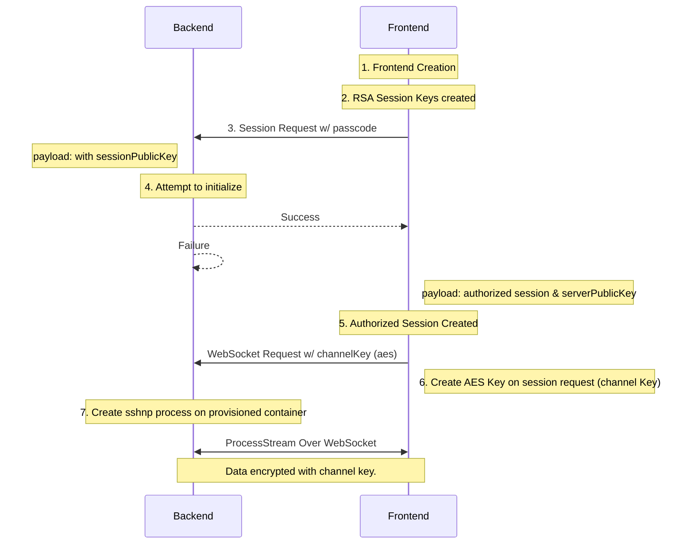

```mermaid
sequenceDiagram
    participant B as Backend
    participant F as Frontend

    Note over F: 1. Frontend Creation
    Note over F: 2. RSA Session Keys created
    F ->> B: 3. Session Request w/ passcode
    Note left of B: payload: with sessionPublicKey
    Note Over B: 4. Attempt to initialize 
    B -->> F: Success
    B -->> B: Failure
    Note right of F: payload: authorized session & serverPublicKey
    Note over F: 5. Authorized Session Created
    F ->> B: WebSocket Request w/ channelKey (aes)
    Note right of F: 6. Create AES Key on session request (channel Key)
    Note over B: 7. Create sshnp process on provisioned container
    B <<->> F: ProcessStream Over WebSocket 
    Note over B,F: Data encrypted with channel key.
```
    

