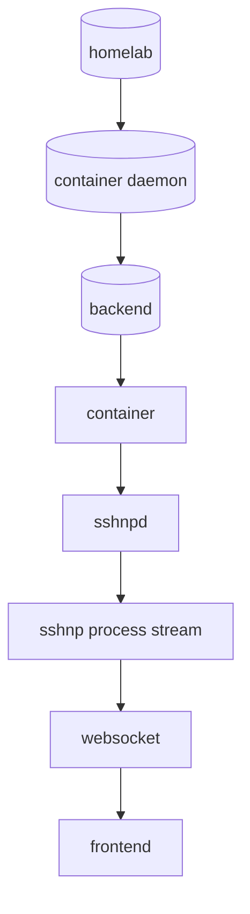

```mermaid
flowchart TD
    A[("homelab")] --> C[(container daemon)] --> B[("backend")] 
    B --> F["container"]
    F --> G["sshnpd"]
    G --> H["sshnp process stream"]
    H --> D["websocket"]
    D --> M["frontend"]

```

